# [FinCore Banking Microservices Monitoring & Observability Project](https://github.com/darpan-cloud/fincore-project.git)


FinCore Solutions is a digital-first banking startup rapidly scaling its suite of containerized microservices — handling critical functionalities such as instant payments, personalized investment tracking, and automated account services.

As the microservices landscape grows, the engineering team faces increasing challenges in maintaining visibility into system performance, detecting bottlenecks, and responding quickly to disruptions.

To maintain reliability and customer trust, **FinCore Solutions** requires a robust **monitoring and observability** solution that offers:

- Real-time system insights  
- Intuitive dashboards  
- Proactive alerting  

This empowers the team to detect issues early and ensure **uninterrupted service delivery** across all microservices.

This project demonstrates an end-to-end **Monitoring & Observability system** for a Dockerized Flask-based **banking microservices** application using **Prometheus + Grafana**,and **Alertmanager**, hosted on **AWS EC2**.  It captures both custom application metrics exposed via **/metrics** and system-level metrics using **Node Exporter**, enabling real-time visibility, alerting, and dashboarding. Infrastructure resources are provisioned using **Terraform** for repeatable, automated deployment.

The Flask app simulates core banking services with microservice-style endpoints:

- /balance: Shows current balance.

- /transfer: Simulates a money transfer.

- /transactions: Lists recent transactions.

Metrics are collected using Prometheus client libraries.

## Main Objective 

- To develop a centralized monitoring and observability solution for FinCore’s containerized microservices environment.

- To instrument each microservice container using Prometheus client libraries for exposing essential performance metrics (e.g., CPU usage, memory consumption, request rates).

- To deploy a Prometheus server for automatically scraping and collecting metrics from all service endpoints.

- To design and configure Grafana dashboards that provide real-time visualization of key indicators such as latency, error rates, and resource utilization.

- To implement alerting mechanisms using Prometheus or Grafana for critical system conditions, with notifications delivered via email or Slack.

- To apply Infrastructure as Code principles using Terraform for automated, repeatable provisioning of the monitoring stack and deployment targets.


## 📚 Table of Contents


- [Tech Stack](#tech-stack)
- [Project Status](#project-status-overview)
- [Folder Structure](#folder-structure)
- [Provision with Terraform](#provision-with-terraform)
- [How to Clone and Run This Project Manually](#how-to-clone-and-run-this-project-manually)
- [Alerting](#alerting)
- [How to Simulate and Revert Alerts](#how-to-simulate-and-revert-alerts)
- [Screenshots](#screenshots)
- [Future Enhancement](#future-enhancements)


## Tech Stack

- 🐍 Language & Framework

    - Python (Flask)

- 📈 Monitoring & Observability

   - 🔭 Prometheus – Metrics scraping and storage

   - 📦 Node Exporter – Host-level system metrics

   - 📊 Grafana – Metrics dashboards and visualization

   - 🚨 Alertmanager – Alerting based on Prometheus rules

- 📦 Containerization

   - 🐳 Docker – Containerizing the Flask application

- ☁️ Cloud Infrastructure

   - 🌐 AWS EC2 – Hosting Prometheus, Grafana, and the app

   - ⚙️ Terraform – Automating EC2 provisioning

- Version Control and Collaboration 

   - Github - Centralized Version Control system


## Project Status Overview

| Project Component                                                              | Status      | Description                                                                                  |
|--------------------------------------------------------------------------------|-------------|----------------------------------------------------------------------------------------------|
| 🧠 Monitoring Setup for Containerized Microservices                            | ✅ Completed | Flask-based banking microservice containerized with Docker and deployed on EC2              |
| 📈 Metrics Instrumentation (App + System Level)                                | ✅ Completed | Prometheus client library added to app + Node Exporter for system metrics                   |
| 📡 Prometheus Server Configuration                                             | ✅ Completed | Prometheus container scrapes metrics from both app and Node Exporter endpoints              |
| 📊 Grafana Dashboards                                                          | ✅ Completed | Node Exporter dashboard configured to display resource and performance metrics              |
| 🚨 Alerting Mechanism (Email/SMTP)                                             | ✅ Completed | Alerts set up in Grafana; SMTP configured for email notifications                         |
| 🏗️ Infrastructure as Code with Terraform                                       | ✅ Completed | EC2, VPC, subnets, routing, IGW provisioned using `main.tf`; remote state via `backend.tf`  |
| ⚙️ Auto-Provisioning of Monitoring Stack                                       | ✅ Completed | User data script installs Docker/Git, clones repo, runs containers automatically            |
| 📦 Grafana Provisioning (Dashboards + Alerts)                                 | ✅ Completed | Dashboards and alerts auto-loaded via mounted provisioning files in Grafana container       |
| 🔍 Proactive Monitoring & Observability                                        | ✅ Completed | Dashboards + alerts + notifications enable early detection and reduced downtime             |


## Folder Structure

```bash
fincore-monitoring/                                          
  ├── app.py # Flask-based banking microservices app exposing /balance, /transfer, etc.                      
  ├── Dockerfile # Docker image for Flask app                 
  ├── prometheus.yml # Prometheus scrape config   
  ├── README.md  # Project documentation                
  ├── grafana/
  │   ├── grafana.ini                 # Grafana config file enabling SMTP and provisioning settings
  │   ├── dashboards/
  │   │   ├── fincore-alerts.json     # Grafana dashboard JSON for custom banking alert panels
  │   │   └── node-exporter-dashboard.json # Grafana dashboard JSON for node-exporter metrics
  │   └── provisioning/
  │       ├── alerting.yaml           # Main alerting provisioning entry to load contact points and alert rules
  │       ├── alerting/
  │       │   ├── contact-points.yml          # Defines contact points (e.g., email) for alert delivery
  │       │   ├── fincore-alerts.yml          # Defines actual alert rules and expressions
  │       │   └── notification-policies.yml   # Policies for how/when to notify contact points
  │       ├── dashboards/
  │       │   └── dashboards.yml      # Grafana dashboards provisioning file (maps folder and files)
  │       └── datasources/
  │           └── prometheus-datasource.yml # Grafana provisioning file for Prometheus data source
  ├── screenshots/     
  │     ├── grafana.png # Screenshot of Grafana 
  |     ├── Grafana2.png # Another dashboard view  
  |     ├── Dashboard-json.png # Screenshot of Exported Dashboard JSON 
  │     ├── Prometheus-targets.png # Screenshot of Prometheus targets
  │     ├── Alert-firing.png # Screenshot of triggered alert
  │     ├── Alerts.png # Screenshot showing alert rules in Grafana
  │     ├── Simulating-alert.png  # Screenshot demonstrating simulated alert
  │     ├── Alert-firing-mail.png # Screenshot of mail for alert firing
  │     ├── Alert-resolved-mail.png # Screenshot of mail for alert resolved notification
  │     └── Backend-S3-statestorage.png # Screenshot of Terraform storing remote state in S3 bucket
  ├── terraform-fincore/
  │     ├── main.tf  # Terraform infrastructure config
  │     ├── output.tf  # Output values from Terraform
  │     ├── terraform.tfvars # Environment-specific variable values
  │     ├── variables.tf # Declared Terraform variables
  │     └── backend.tf # Defines remote backend (S3) for shared state

```

## Project Architecture Diagram

```mermaid

flowchart TD
    %% Infrastructure Layer
    subgraph "Infrastructure Layer"
        direction TB
        AWS["AWS Cloud"]:::infra
        VPC["VPC"]:::infra
        Subnet["Subnet"]:::infra
        SG["Security Group\n(Ports: 22,5000,9090,9100,3000)"]:::infra
        EC2["EC2 Instance\n(Docker Host)"]:::infra
        S3["S3 Bucket\n(Terraform State)"]:::infra
        Terraform["Terraform IaC"]:::iac
    end

    %% EC2 Docker Host Boundary
    subgraph "EC2 Instance / Docker Host"
        direction TB
        App["Flask App\n(port 5000)"]:::app
        NodeExp["Node Exporter\n(port 9100)"]:::monitor
        Prometheus["Prometheus\n(port 9090)"]:::monitor
        Grafana["Grafana\n(port 3000)"]:::viz
    end

    %% External Entities
    User["Developer / Operator\n(Web Browser)"]:::external
    Email["SMTP / Email"]:::external
    Slack["Slack"]:::external

```



```mermaid
    %% Grafana Provisioning Config
    subgraph "Grafana Provisioning" 
        direction TB
        GFini["grafana.ini"]:::config
        GFds["prometheus-datasource.yml"]:::config
        GFdb1["fincore-alerts.json"]:::config
        GFdb2["node-exporter-dashboard.json"]:::config
        GFdash["dashboards.yml"]:::config
        GFalerting["alerting.yaml"]:::config
        GFcp["contact-points.yml"]:::config
        GFal["fincore-alerts.yml"]:::config
        GFnpp["notification-policies.yml"]:::config
    end

    %% Terraform Config Files
    subgraph "Terraform Config" 
        direction TB
        TFmain["main.tf"]:::config
        TFvar["variables.tf"]:::config
        TFbackend["backend.tf"]:::config
        TFoutput["output.tf"]:::config
        TFtfvars["terraform.tfvars"]:::config
    end

    %% Click Events
    click TFmain "https://github.com/darpan-cloud/fincore-project/blob/flask-app/terraform-fincore/main.tf"
    click TFvar "https://github.com/darpan-cloud/fincore-project/blob/flask-app/terraform-fincore/variables.tf"
    click TFbackend "https://github.com/darpan-cloud/fincore-project/blob/flask-app/terraform-fincore/backend.tf"
    click TFoutput "https://github.com/darpan-cloud/fincore-project/blob/flask-app/terraform-fincore/output.tf"
    click TFtfvars "https://github.com/darpan-cloud/fincore-project/blob/flask-app/terraform-fincore/terraform.tfvars"
    click App "https://github.com/darpan-cloud/fincore-project/blob/flask-app/app.py"
    click App "https://github.com/darpan-cloud/fincore-project/tree/flask-app/Dockerfile"
    click Prometheus "https://github.com/darpan-cloud/fincore-project/blob/flask-app/prometheus.yml"
    click GFini "https://github.com/darpan-cloud/fincore-project/blob/flask-app/grafana/grafana.ini"
    click GFdb1 "https://github.com/darpan-cloud/fincore-project/blob/flask-app/grafana/dashboards/fincore-alerts.json"
    click GFdb2 "https://github.com/darpan-cloud/fincore-project/blob/flask-app/grafana/dashboards/node-exporter-dashboard.json"
    click GFds "https://github.com/darpan-cloud/fincore-project/blob/flask-app/grafana/provisioning/datasources/prometheus-datasource.yml"
    click GFdash "https://github.com/darpan-cloud/fincore-project/blob/flask-app/grafana/provisioning/dashboards/dashboards.yml"
    click GFalerting "https://github.com/darpan-cloud/fincore-project/blob/flask-app/grafana/provisioning/alerting.yaml"
    click GFcp "https://github.com/darpan-cloud/fincore-project/blob/flask-app/grafana/provisioning/alerting/contact-points.yml"
    click GFal "https://github.com/darpan-cloud/fincore-project/blob/flask-app/grafana/provisioning/alerting/fincore-alerts.yml"
    click GFnpp "https://github.com/darpan-cloud/fincore-project/blob/flask-app/grafana/provisioning/alerting/notification-policies.yml"

```

```mermaid
    %% Relationships & Data Flow
    Terraform -->|"provisions"| AWS
    Terraform -->|"state stored"| S3
    AWS --> VPC
    VPC --> Subnet
    Subnet --> SG
    SG --> EC2

    EC2 --> App
    EC2 --> NodeExp
    EC2 --> Prometheus
    EC2 --> Grafana

    User -->|"HTTP Dashboard"| Grafana
    Grafana -->|"HTTP Pull"| Prometheus
    Prometheus -->|"Pull /metrics"| App
    Prometheus -->|"Pull /metrics"| NodeExp
    Prometheus -->|"alerts"| Email
    Prometheus -->|"alerts"| Slack
    Grafana -->|"alerts"| Email
    Grafana -->|"alerts"| Slack

    %% Styles
    classDef infra fill:#cce5ff,stroke:#0056b3,color:#0056b3;
    classDef app fill:#d4edda,stroke:#155724,color:#155724;
    classDef monitor fill:#fff3cd,stroke:#856404,color:#856404;
    classDef viz fill:#e2e3e5,stroke:#6c757d,color:#6c757d;
    classDef iac fill:#f8d7da,stroke:#721c24,color:#721c24;
    classDef config fill:#f0f0f0,stroke:#999999,color:#333333;
    classDef external fill:#f5f5f5,stroke:#333333,color:#333333;
    class TFmain,TFvar,TFbackend,TFoutput,TFtfvars,GFini,GFds,GFdb1,GFdb2,GFdash,GFalerting,GFcp,GFal,GFnpp config
    class App app
    class Prometheus monitor
    class NodeExp monitor
    class Grafana viz
    class AWS,S3,EC2,VPC,Subnet,SG infra
    class Terraform iac

```


## Provision with Terraform
### Prerequisites
- Terraform Installed

- AWS credentials configured using aws configure

- SSH key pair (public & private)

If key pair not available use :

#### For Linux and MacOS
```
ssh-keygen -t rsa -b 4096 -f ~/.ssh/<keyname>
```

#### For Windows:
```
mkdir %USERPROFILE%\.ssh
ssh-keygen -t rsa -b 4096 -f %USERPROFILE%\.ssh\fincore-key
```


You can provision the entire infrastructure on AWS EC2 using [Terraform](https://www.terraform.io/). This includes:
- Launching EC2 instance
- Installing Docker
- Cloning this GitHub repo
- Running

   - Flask-based Banking App

   - Prometheus for metrics scraping

   - Node Exporter for system metrics

   - Grafana with preloaded dashboards, alerts, and Prometheus datasource

### Terraform State Management
- To enable collaborative and consistent infrastructure management, the project uses remote state storage with an S3 bucket as the Terraform backend.

- backend.tf configures the S3 backend to store the Terraform state file remotely.

- This ensures state persistence, team collaboration, and safe concurrent operations.


### 📁 Terraform Directory Structure


| File               |                          Purpose                           |
|--------------------|------------------------------------------------------------|
| `main.tf`          |   Defines infrastructure (VPC, EC2, Security Groups, etc.) |
| `variables.tf`     |   Declares input variables like AMI ID, Key Path           |
| `outputs.tf`       |   Prints output like public IP                             |
| `backend.tf`       |   Configures S3 backend for state storage                  |
| `terraform.tfvars` |   Contains actual variable values (created by user)        |

### Terraform Configuration Breakdown
- Custom VPC, Public Subnet, and Internet Gateway
- Route Table and Route Table Association for outbound access
- Security Group to allow access to ports (22, 3000,9100)
- Key Pair for SSH authentication using user-provided public key
- EC2 Instance with user-data to auto-install Docker, clone repo, and run:
- Flask banking microservice
- Prometheus, Node Exporter, Grafana with auto-provisioning

### Sample terraform.tfvars
Create a terraform.tfvars file inside the terraform-fincore directory:

```hcl
aws_region      = "ap-south-1"
ami_id          = "ami-0d0ad8bb301edb745"  
key_name        = "fincore-key"
public_key_path = "/home/ec2-user/.ssh/fincore-key.pub"

```
> ⚠️ Update the key_name and public_key_path according to your system.

### Deploy via Terraform

```bash
cd terraform-fincore    # Changes to terraform directory
# Create terraform.tfvars With proper key_paths
terraform init          # Initialize project
terraform plan          # Preview actions
terraform apply         # Create resources
```
Once it finishes, you’ll see the public IP of the new EC2 instance. You can then access:

Flask app: `http://<public-ip>:5000`

Prometheus: `http://<public-ip>:9090`

Grafana:  `http://<public-ip>:3000`


## How to Clone and Run This Project Manually
### 🔹 1. Clone the Repository

```bash
git clone https://github.com/darpan-cloud/fincore-project.git
cd fincore-project
```

### 🔹 2.  Launch EC2 Instance (Amazon Linux 2)
- Open ports in **Security Group**: `5000`, `9090`, `3000`, `9100`
- Download your `.pem` file for SSH access

> You can also use Terraform to provision the EC2 instance. See
> [Terraform provisioning guide](#provision-with-terraform) for steps to provision.

### 🔹 3. SSH into EC2

```bash
ssh -i "path/to/your-key.pem" ec2-user@<EC2_PUBLIC_IP>
```


### 🔹 4. Install Docker (Amazon Linux 2)

```bash
sudo yum update -y
sudo amazon-linux-extras enable docker
sudo yum install docker -y
sudo service docker start
sudo usermod -aG docker ec2-user
exit
```

Then reconnect via SSH:

```bash
ssh -i "your-key.pem" ec2-user@<EC2_PUBLIC_IP>
```

### 🔹 5. Upload Project from Your Local PC

```bash
scp -i "path/to/your-key.pem" -r fincore-monitoring/ ec2-user@<EC2_PUBLIC_IP>:/home/ec2-user/
```


### 🔹 6. Build and Run Flask App

```bash
cd fincore-monitoring
docker build -t banking-app .
docker run -d -p 5000:5000 banking-app
```

Open in browser:
`http://<EC2_PUBLIC_IP>:5000/balance`


### 🔹 7. Start Prometheus

```bash
docker run -d -p 9090:9090 \
  -v $PWD/prometheus.yml:/etc/prometheus/prometheus.yml \
  prom/prometheus
```

- Check Prometheus Targets:
`http://<EC2_PUBLIC_IP>:9090/targets`

- Verify that both Node Exporter and the banking app are marked UP in the Prometheus targets list.

#### To Simulate Load using CLI use:
`curl http://<IP>:5000/balance`

`curl http://<IP>:5000/transfer`

`curl http://<IP>:5000/transactions`

### 🔹 8. Start Node Exporter

```bash
docker run -d -p 9100:9100 prom/node-exporter
```

### 🔹 9. Start Grafana


```bash
docker run -d -p 3000:3000 \
                -v $(pwd)/grafana/provisioning:/etc/grafana/provisioning \
                -v $(pwd)/grafana/dashboards:/var/lib/grafana/dashboards \
                -v $(pwd)/grafana/grafana.ini:/etc/grafana/grafana.ini \
                -v grafana-storage:/var/lib/grafana \
                grafana/grafana
```

- Access Grafana:
`http://<EC2_PUBLIC_IP>:3000`

- Login:

  - Username: admin

  - Password: admin

- Grafana Dashboard and Alerts with Data-Source(Prometheus) will be automatically provisioned.

   - To do these Manually Run :

   ```bash
   docker run -d -p 3000:3000 grafana/grafana
   ```
   This will only start Grafana 

   - Follow steps 9-i and 9-ii to import Dashboard and Alerts


### 🔹 9-i. Import Grafana Dashboard
- Open Grafana in browser

- Go to Dashboards → Import

- Upload: Grafana/node-exporter-dashboard.json

- Select Prometheus as data source

- View live metrics


#### 🧪 How to Generate Metrics
Open the following repeatedly to simulate API load:

`http://<EC2_PUBLIC_IP>:5000/balance`


This updates metrics like:

- http_requests_total

- http_request_duration_seconds

- http_request_errors_total


#### 📈 Metrics Tracked
- Application Metrics

- Total HTTP requests

- Request durations

- Error count

- System Metrics (via Node Exporter)

- CPU usage

- Memory usage

- Disk and filesystem stats

### 🔹 9-ii. Import Alerts

- Open Grafana at `http://<EC2-IP>:3000` and log in.

- Go to **Alerting → Alert rules → Import** 

-  Upload `Grafana/fincore-alerts.json`.

- Select the appropriate Prometheus data source.

- Save/import to recreate all four alert rules.

## Alerting

This project includes four active Grafana-managed alert rules. They are exported and stored in `Grafana/fincore-alerts.json`. Anyone cloning the repo can import them into Grafana to reproduce the same alerting behavior.

### Alert Rules Included

1. ***High Disk I/O Wait*** (`fincore-alert-disk I/O`)

   - Purpose: Detect excessive CPU time spent waiting on disk I/O.

   - Query:

   ``` promql
   rate(node_cpu_seconds_total{mode="iowait"}[1m]) * 100
   Condition: Above 20% for 2 minutes.
   ```

   - Labels: `severity: warning`

   - Summary: High Disk I/O Wait Detected.

   - Description: CPU is spending more than 20% of its time waiting on disk I/O on instance `{{ $labels.instance }}`.

2. ***High CPU Usage*** (`fincore-alert`)

   - Purpose: Detect when overall CPU usage exceeds 80%.

   - Query:

   ```promql

   100 - (avg by(instance) (rate(node_cpu_seconds_total{mode="idle"}[2m])) * 100)
   ```
   - Condition: Above 80% for 2 minutes.

   - Labels: `severity: critical`

   - Summary: High CPU usage detected.

   - Description: CPU usage on instance `{{ $labels.instance }}` has exceeded 80% for the last 2 minutes.

3. ***High Memory Usage*** (`fincore-alert-memory`)

   - Purpose: Detect when memory usage exceeds 80%.

   - Query:

   ```promql

   100 * (1 - (node_memory_MemAvailable_bytes / node_memory_MemTotal_bytes))
   ```

   - Condition: Above 80% for 2 minutes.

   - Labels: `severity: warning`

   - Summary: High Memory Usage.

   - Description: Memory usage on instance `{{ $labels.instance }}` is above 80%.

4. ***Low Disk Space*** (`fincore-alert-lowdisk`)

   - Purpose: Alert when disk usage is high (>80%).

   - Query:

   ```promql

   (node_filesystem_size_bytes{fstype!~"tmpfs|overlay"} - node_filesystem_free_bytes{fstype!~"tmpfs|overlay"}) 
   / node_filesystem_size_bytes{fstype!~"tmpfs|overlay"} * 100
   ```

   - Condition: Above 80% for 2 minutes.

   - Labels: `severity: warning`

   - Summary: Disk space running low.

   - Description: The disk usage on instance `{{ $labels.instance }}` has crossed 80%.


### How to Simulate and Revert Alerts
You can manually trigger and then revert the alert conditions to test your Grafana alert rules.

#### 🔺 1. High Disk I/O Wait (fincore-alert-disk I/O)

**Simulate:** Generate heavy disk I/O activity so the CPU spends time in `iowait` mode.

```bash
dd if=/dev/zero of=testfile bs=10M count=500

```


This writes 5GB to disk, creating high disk I/O wait time.


**Revert:**

```bash
rm testfile
```

Removes the file and stops I/O activity.

#### 🔺 2. High CPU Usage (`fincore-alert`)

**Simulate:** Use stress to load the CPU above 80% for at least 2 minutes.

```bash
sudo yum install -y stress
stress --cpu 2 --timeout 60s
```

Runs 2 CPU workers for 60 seconds.


**Revert:**
The stress process stops automatically after the timeout.


#### 🔺 3. High Memory Usage (fincore-alert-memory)

**Simulate:** Allocate memory to push usage above 80%.

```bash
sudo yum install -y stress
stress --vm 2 --vm-bytes 1G --timeout 60s
```

Allocates 2GB of memory for 60 seconds.

**Revert:**
Memory is freed automatically after the command ends.

 


#### 🔺 4.  Low Disk Space (fincore-alert-lowdisk)

**Simulate :** Create a large dummy file to consume more than 80% of available disk

```bash
dd if=/dev/zero of=bigfile bs=100M count=100
```

Creates a 10GB file.

**Revert :**

```bash
rm bigfile
```
Deletes the file and frees up space.

## Screenshots 

### Running Docker Containers
This screenshot displays all active Docker containers for the project, including Grafana, the banking microservice, Prometheus, and Node Exporter, each mapped to their respective ports.


---


### Prometheus targets page (Prometheus-targets.png)

Shows all the service endpoints (Flask App, Node Exporter) being scraped successfully by Prometheus.


---

### Grafana dashboard (Grafana.png)

Provides real-time visualizations of system metrics like CPU, memory, request rates, and error rates from Prometheus data sources.


---

### Grafana dashboard exported JSON

The screenshot below shows the pre-configured fincore-alert.json used to automatically provision the Grafana dashboard. It defines panel layouts, data sources, alert rules, and visualizations for real-time monitoring of the banking microservice.


---

### Alerts (Alerts.png)

Displays configured alerts (e.g., high CPU usage or memory consumption thresholds) in Grafana


---

### Alert Firing (on grafana)

Indicates an alert condition that has triggered, visible on the dashboard with red status.


---

### Alert Firing Mail

Email received when a Grafana alert fires. Ensures critical incidents are reported in real time.


---

### Alert resolved mail

Email confirmation showing that the previously triggered alert condition has been resolved.


---

### Terraform Remote State via S3 (infra.tfstate)

The following screenshot shows the `infra.tfstate` file automatically created and managed in the configured S3 bucket, ensuring consistent and shareable infrastructure state across team members.


---

## Future Enhancements

- Use Docker Compose for easier deployment

- Automated Setup Scripts (Shell/Terraform modules) for reproducible provisioning

- Add real-time transaction processing alerts

- Separate microservices for each banking endpoint

- Add API load testing (e.g. for /transfer spikes)

---

**[Return to Top](#fincore-banking-microservices-monitoring--observability-project)**


